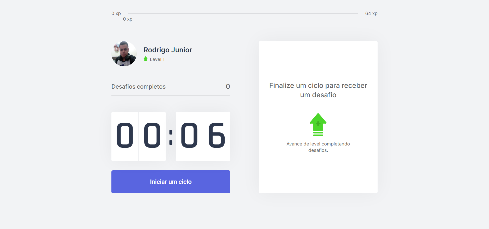
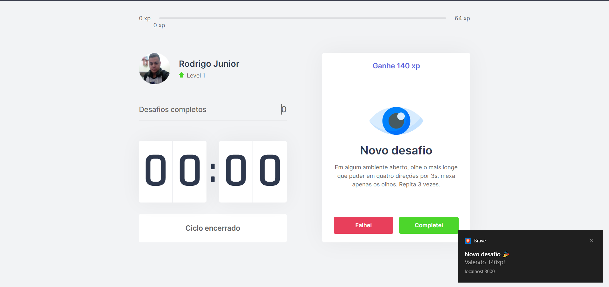
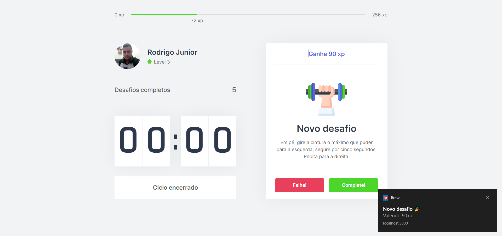
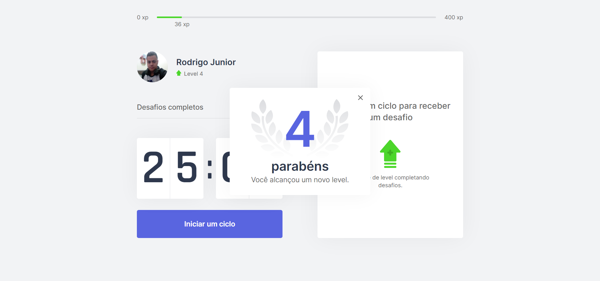

  

  

  

   

  

<h1 align="center">Move.it<ht>
  
<h4 align="center"> 
	🚧  Moveit  Concluído 🚀 🚧
</h4>

 <a href="#-sobre-o-projeto">Sobre</a> •
 <a href="#-funcionalidades">Funcionalidades</a> •
 <a href="#-layout">Layout</a> • 
 <a href="#-como-executar-o-projeto">Como executar</a> • 
 <a href="#-tecnologias">Tecnologias</a> • 
 <a href="#-autor">Autor</a> • 

## 💻 Sobre o projeto

  <strong>Moveit</strong> é um projeto que visa o bem estar de pessoas que trabalham muitas horas em frente ao computador 👩‍💻👨‍💻 propondo desafios de exercícios físicos fáceis de serem reproduzidos a cada 30 minutos de trabalho e de uma maneira mega intuitiva podendo subir de level a cada desafio concluído.

---

## ⚙️ Funcionalidades

 

 - [✔] Iniciar timer de trabalho
 - [✔] Cancelar timer de trabalho
 - [✔] Realizar desafios
 - [✔] Subir de Level
 - [✔] Verificar level atual e quanto falta para subir
 

---

## 🎨 Layout

  
O <strong>Layout</strong> completo está disponível no Figma   

  

  

    
    
    
    
  

---

## 🚀 Como executar o projeto

### Pré-requisitos

  Para executar este projeto você precisara de um editor de texto(código). Recomendo a utilização do VSCode por ser mais completo e fácil entendimento, para baixa-lo <a href="https://code.visualstudio.com/Download">Clique aqui</a>

### Executando o projeto

  

    1. <strong>Clone o projeto</strong>: Abra o terminal na pasta que desejar e digite: <a style="color: #4361ee;">git clone https://github.com/RodrigoJuniorLiyah/MOVEIT---Rocketseat.git</a> ou <a href="https://github.com/RodrigoJuniorLiyah/MOVEIT---Rocketseat/archive/main.zip">clique aqui</a> e baixe o projeto diretamente e extraia os arquivos onde desejar.
  

  

    2. <strong>Intale as dependências do projeto</strong>: Com o VSCode aberto abra o terminal com "Ctrl+" " (aspas abaixo do Esc) com o terminal aberto digite "<strong style="color: #4361ee;">npm install</strong> ou <strong style="color: #4361ee;">yarn install</strong>"
  

  
  

    3. <strong>Execute o projeto</strong>: Com o terminal aberto digite "<strong style="color: #4361ee;">npm run dev</strong> ou <strong style="color: #4361ee;">yarn dev</strong>" abra seu navegador e digite "localhost:3000"
  

